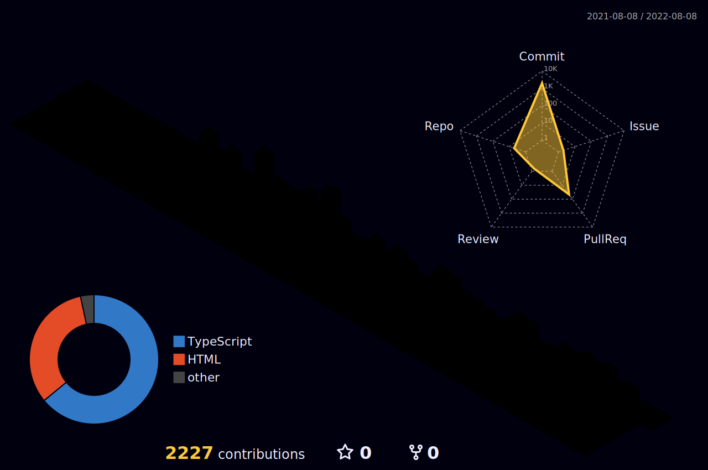

<div align="center">
  
  <br/>
  <a href="https://www.linkedin.com/in/michele-pulvirenti" target="_blank" >
    
  </a>
  <a href="https://michelepulvirenti.vercel.app" target="_blank">
    
  </a>
  <a href="mailto:michele00.pulvirenti@gmail.com" target="_blank" >
    
  </a>
</div>


<div align="center">
  
  <br/>
  
  <a href="https://github.com/mikecheek">
    
  </a>

<a href="https://docs.microsoft.com/en-us/cpp/?view=msvc-170" target="_blank" rel="noreferrer"></a>
<a href="https://www.oracle.com/java/" target="_blank" rel="noreferrer"></a>
<a href="https://developer.mozilla.org/en-US/docs/Web/JavaScript" target="_blank" rel="noreferrer"></a>
<a href="https://www.typescriptlang.org/" target="_blank" rel="noreferrer"></a>
<a href="https://developer.mozilla.org/en-US/docs/Glossary/HTML5" target="_blank" rel="noreferrer"></a>
<a href="https://www.w3.org/TR/CSS/#css" target="_blank" rel="noreferrer"></a>
<a href="https://sass-lang.com/" target="_blank" rel="noreferrer"></a>
<a href="https://tailwindcss.com/" target="_blank" rel="noreferrer"></a>
  <a href="https://reactjs.org/" target="_blank" rel="noreferrer"></a>
<a href="https://nextjs.org/docs" target="_blank" rel="noreferrer"></a>
<a href="https://www.gatsbyjs.com/" target="_blank" rel="noreferrer"></a>

<!--  -->
</div>

<!--
<div align="center">
  
 <h3>My GitHub Stats</h3>

  <a href="http://www.github.com/mikecheek" >
     
  </a> 
  
  <a href="http://www.github.com/mikecheek"></a>
  -->
  
<!--   <a href="http://www.github.com/mikecheek"></a>


<br/>
<br/>
</div>

```js
export const mike = {

  name: "Michele",
  surname: "Pulvirenti",
  age: 21,
  
  skills: {
    codingLanguages: [ "C", "Java", "Javascript", "Typescript", "Assembly MIPS", "BASH (Unix Shell)", "PHP" ],
    frameworks: [ "React", "Gatsby", "NextJs" ],
    others: [ "HTML", "CSS", "Linux", "SQL", "Matlab", "Simulink" ]
  },
  
  constacts: {
    email: "michele00.pulvirenti@gmail.com",
    linkedin: "https://www.linkedin.com/in/michele-pulvirenti"
  }
};
```
-->

<!--
**Mike-cheek/Mike-cheek** is a ✨ _special_ ✨ repository because its `README.md` (this file) appears on your GitHub profile.

Here are some ideas to get you started:

- 🔭 I’m currently working on ...
- 🌱 I’m currently learning ...
- 👯 I’m looking to collaborate on ...
- 🤔 I’m looking for help with ...
- 💬 Ask me about ...
- 📫 How to reach me: ...
- 😄 Pronouns: ...
- ⚡ Fun fact: ...
-->
